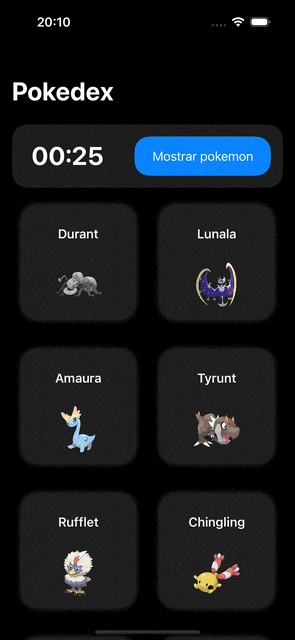

# `PokeDex` - Pokedex App in SwiftUI

- [Overview](#overview)
- [Pokedex](#pokedexapp)
- [Unit Testing](#unit-testing)
   - [Test Cases](#test-cases)
- [Error handling](#error-handling)

## Overview
`PokeDexView` is the primary view in a SwiftUI-based iOS app designed to function as a Pokedex. This app utilizes the MVVM (Model-View-ViewModel) architecture pattern, separating the user interface (View) from the business logic and data handling (ViewModel).

# Demo

<p align="center">

</p>


## Key Components

### ViewModel: `PokeDexViewModel`
- **Role**: Serves as the ViewModel in the MVVM architecture, managing data and business logic.
- **Properties**:
  - `@Published var isLoading`: Indicates whether the app is in a loading state.
  - `@Published var timerIsActive`: Tracks the active state of a timer.
  - `@Published var pokemons`: Stores a list of Pokémon fetched from the API.
  - `timerClock`: A timer that ticks every second.
  - `fetchTimer`: A timer that triggers a Pokémon fetch every 30 seconds.
  - `pokeAPI`: An instance of `PokeAPI` for fetching Pokémon data.
- **Methods**:
  - `timeString(time:)`: Formats an integer time value into a string.
  - `fetchPokemon()`: Initiates fetching Pokémon from the API.

### View: `PokedexView`
- **Layout**: Utilizes `NavigationStack` and `ScrollView` for navigation and scrolling capabilities.
- **State Management**:
  - `@StateObject private var vm`: Instance of `PokedexViewModel` for data and logic.
  - `@State var timeElapsed`: Tracks the elapsed time.
- **UI Components**:
  - `HStack` with a timer and a button to fetch Pokémon.
  - `LazyVGrid` displaying Pokémon cards.
- **Dynamic Features**:
  - Timer display updates every second.
  - Fetches and displays new Pokémon every 30 seconds.
  - Shows loading state and handles button interactions.

### Additional Features
- **`ShowPokemonButton`**: A custom button to manually fetch Pokémon.
- **`StopTimerButton`**: A placeholder for future implementation to stop/resume the timer.

## Architecture: MVVM
- **Model**: Represented by the Pokémon data structure.
- **View**: `Pokedex` displays the UI and interacts with the user.
- **ViewModel**: `PokedexViewModel` handles the app's logic and data.

## Functionality
- **Timer Function**: A timer updates every second, and another timer fetches Pokémon data every 30 seconds, resetting the elapsed time.
- **Data Fetching**: Fetches Pokémon data from `PokeAPI` and updates the UI with new Pokémon cards.
- **User Interactions**: Allows the user to fetch Pokémon manually and potentially (not implemented yet) stop/resume the timer.

## API Response and Decoding into the Model

Base Url for the PokeAPI: https://pokeapi.co


### API Response Structure

The PokeAPI provides a JSON response containing detailed information about each Pokémon. The response for a Pokémon typically includes various properties such as `id`, `name`, and `sprites`. The `sprites` object contains nested objects, one of which is `other`, which further nests `official-artwork`. This `official-artwork` contains the URL for the official artwork of the Pokémon.

An example snippet of the JSON response from the API:

```json
{
  "id": 1,
  "name": "bulbasaur",
  "sprites": {
    "other": {
      "official-artwork": {
        "front_default": "https://example.com/artwork/bulbasaur.png"
      }
    }
  }
}
```

# Pokemon Model

## Structure

- `Pokemon`: The main struct representing a Pokémon.
  - `id` (Int): Unique identifier for the Pokémon.
  - `name` (String): The name of the Pokémon.
  - `sprites` (Sprites): A struct to hold various sprite URLs.

- `Sprites`: A nested struct within `Pokemon`.
  - `other` (Other): A struct to hold additional sprites, such as official artwork.

- `Other`: A nested struct within `Sprites`.
  - `officialArtwork` (OfficialArtwork): Struct for accessing the Pokémon's official artwork.

- `OfficialArtwork`: A nested struct within `Other`.
  - `frontDefault` (URL): URL pointing to the Pokémon's official front artwork.

## Implementation Details

- The `Pokemon` struct conforms to `Decodable` and `Identifiable`, making it easy to decode from JSON data and use in SwiftUI Lists.
- Custom `CodingKeys` are used in the `Other` and `OfficialArtwork` structs to map JSON keys to Swift property names.
- The structs are designed to closely follow the JSON structure of the PokeAPI, ensuring seamless data decoding.

# Unit Testing

## Overview
The Pokedex app includes a suite of unit tests designed to ensure the reliability and correctness of its functionality. These tests are written using the XCTest framework and are contained within the `PokedexTests.swift` file.

## Test Cases

### `testPokemonDecoding`

- **Purpose**: Validates the correct decoding of Pokémon data from JSON format to the `Pokemon` struct.
- **Methodology**:
  - A JSON string representing a Pokémon is created. This string mimics the response structure of the PokeAPI.
  - The JSON string is decoded into an instance of the `Pokemon` struct using `JSONDecoder`.
  - Assertions (`XCTAssertEqual`) are used to verify that the decoded Pokémon data matches the expected values.

- **Code Snippet**:
  ```swift
  func testPokemonDecoding() throws {
      // Example JSON data for testing
      let jsonData = """
      {
          "id": 1,
          "name": "Bulbasaur",
          "sprites": {
              "other": {
                  "official-artwork": {
                      "front_default": "https://raw.githubusercontent.com/PokeAPI/sprites/master/sprites/pokemon/other/official-artwork/1.png"
                  }
              }
          }
      }
      """.data(using: .utf8)!

      // Decoding the JSON data to the Pokemon struct
      let pokemon = try JSONDecoder().decode(Pokemon.self, from: jsonData)

      // Assertions to verify the decoding is correct
      XCTAssertEqual(pokemon.id, 1)
      XCTAssertEqual(pokemon.name, "Bulbasaur")
      XCTAssertEqual(pokemon.sprites.other.officialArtwork.frontDefault.absoluteString, "https://raw.githubusercontent.com/PokeAPI/sprites/master/sprites/pokemon/other/official-artwork/1.png")
  }


# Error Handling

## Overview

Robust error handling is crucial for the reliability and user experience of the Pokedex app. The app includes a custom error enumeration, `PokeAPIError`, which conforms to the `Error` and `LocalizedError` protocols. This enum handles various errors that can occur during API calls and data processing.

## PokeAPIError Enum

### Error Cases

- **invalidURL**: 
  - **Description**: Indicates that the provided URL is invalid.
  - **Error Message**: "The URL provided was invalid."
- **noData**: 
  - **Description**: Represents a scenario where no data is returned from the server.
  - **Error Message**: "No data was received from the server."
- **networkError(Error)**: 
  - **Description**: Captures errors related to network requests.
  - **Error Message**: "Network error: [Underlying Error Description]"
- **decodingError**: 
  - **Description**: Occurs when there is a failure in decoding the data.
  - **Error Message**: "Failed to decode the data into the specified format."

### Implementation

```swift
enum PokeAPIError: Error, LocalizedError {
    case invalidURL
    case noData
    case networkError(Error)
    case decodingError

    var errorDescription: String? {
        switch self {
        case .invalidURL:
            return "The URL provided was invalid."
        case .noData:
            return "No data was received from the server."
        case .networkError(let underlyingError):
            return "Network error: \(underlyingError.localizedDescription)"
        case .decodingError:
            return "Failed to decode the data into the specified format."
        }
    }
}

